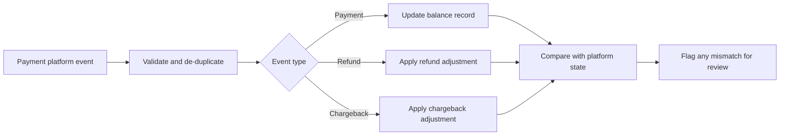

# Integration & Support Engineering at SwipeAras

Integration & Support Engineer at SwipeAras, a fintech payments company built on a major payments platform.
May 2026 to September 2026.

> All code and work product from this role belong to SwipeAras and are not included here. This repo describes my role, the problems I worked on, and how I approached them at a high level.

## Overview

I joined SwipeAras during a period of rebuilding and took ownership of an existing payments integration codebase. My work spanned three areas: making the system reliable, making partner onboarding repeatable, and making partner support scalable. I came into the role with a background in Java backend development and a career in education, which shaped how I approached both the technical work and the partner-facing documentation.

## Skills demonstrated

- Payments platform integration and balance account management
- Refund and chargeback handling
- Writing technical specifications
- Shipping features and resolving reported bugs
- Debugging and maintaining a production codebase
- Workflow automation and event-driven notifications
- Process design for partner onboarding
- Technical writing and knowledge base design for AI retrieval

## Balance account integrity

The goal: Balance records needed to stay accurately aligned with the payment platform, including through refunds and chargebacks. In payments, keeping these in sync is what ensures partners see correct balances and the team avoids manual cleanup.

What I did: I wrote the technical specification defining how refunds, chargebacks, and balance accounts should behave, covering how each event type should be recorded and how internal balances should stay consistent with the platform. I then built logic against that spec to keep internal balance state accurately aligned with the payment platform and to handle refund and chargeback flows correctly, so that each event was reflected once and in the right place.

The general pattern (simplified, not company-specific):

What I took from it: Correctness in financial systems depends on treating the payment platform as the source of truth, handling every event exactly once, and building in a way to detect drift instead of assuming it will not happen.

## Automated partner onboarding

The goal: Partners moving through onboarding needed clear, timely instructions at each stage.

What I did: I designed the partner onboarding process end to end and built automated workflows that emailed partners stage-specific instructions whenever their record moved to a new stage on the onboarding pipeline dashboard.

Result: Partners received the right guidance at the right time without anyone on the team having to remember to send it, and the onboarding process became consistent and repeatable.

## Knowledge base for the AI support bot

The goal: The platform's AI support bot answered partner questions using a knowledge base as its source material, so the quality of its answers depended on how that content was written and organized.

What I did: I wrote and organized the partner knowledge base the bot drew from. I designed the header hierarchy and section structure so the bot could retrieve focused, accurate answers. I did not build the bot itself; my work was the content and structure behind its answers.

What I took from it: Writing for AI retrieval is its own skill. Clear, specific headers and self-contained sections help a bot find the right answer. My background as a teacher helped here, since good documentation and good lesson design share the same goal of making information easy to find and understand.

## Shipping features and fixing bugs

I shipped features and fixed bugs throughout my time on the platform while keeping it running for active partners.

- Built and shipped new functionality to support partners and the platform's growth.
- Fixed reported bugs across the platform, including issues with calendar and date pickers.

## Contact

Leanne Byrne
[LinkedIn](https://www.linkedin.com/in/leanne-byrne-96b08822a) · [GitHub](https://github.com/LeanneByrne)
